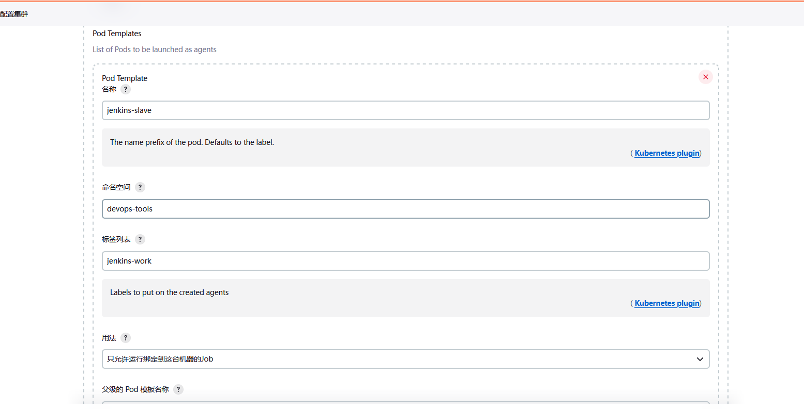

#### Kubernetes Jenkins部署

1、为Jenkins创建命名空间。最好将所有DevOps工具归类为与其他应用程序分开的名称空间。
```
kubectl create namespace devops-tools
```
2、创建`serviceaccount.yaml`,并绑定授权
3、创建持久化卷`volume.yaml` （nfs、或者本地、或者其他存储）
4、创建`deployment.yaml`部署文件。
- `securityContext`用于Jenkins pod能够写入本地持久卷
- 存活和就绪状态探测器用来监测jenkins的健康状况。
- 基于本地存储类的本地持久卷，持久化Jenkins数据路径`/var/jenkins_home`

参数说明

JAVA_OPTS： JVM 参数设置
JENKINS_OPTS： Jenkins 参数设置


如果不需要本地存储持久卷，可以将部署中的卷定义替换为主机目录
```
volumes:
- name: jenkins-data
emptyDir: \{}
```
5、创建`NodePort`类型的service，公开端口（其他方式如ingress） 

密码可以在pod的日志的末尾找到
```
kubectl exec -it jenkins-xxx cat /var/jenkins_home/secrets/initialAdminPassword -n devops-tools
```

**安装向导**
这个设置向导将带您完成几个快速的“一次性”步骤来解锁Jenkins，使用插件自定义它，并创建第一个管理员用户，通过该用户可以继续访问Jenkins。

1、解锁jenkins
当您第一次访问新的Jenkins实例时，系统会要求您使用自动生成的密码解锁它。
浏览到http://localhost:8080(或您在安装Jenkins时为它配置的任何端口)，等待解锁Jenkins页面出现。


**自定义插件安装**
- 安装推荐的插件——安装推荐的插件集，这些插件基于最常见的用例。
- 选择要安装的插件——选择要初始安装的插件集。当您第一次访问插件选择页面时，默认情况下会选择建议的插件。


**安装配置kubernetes插件**


#### Kubernetes和Jenkins的配置信息

配置管理->系统配置->节点管理->配置clouds


**连接k8s配置**
- 名称为： kubernetes (在Jenkins Cloud中的其他实例中唯一标识此云实例)
- 其中Kubernetes命名空间填写我们Jenkins所在的命名空间
- Kubernetes 地址: 填写kube-api地址或者域名 如：https://10.0.0.1  由于jenkins在k8s集群中安装，直接用service地址,不用再配置证书和凭据。如果jenkins部署不在k8s集群中 Kubernetes 地址: https://ip:6443，并且凭据下选择相应的权限的用户凭据


如果连接测试失败，很可能是权限问题，我们就需要把ServiceAccount的凭证jenkins-admin添加进来。

Jenkins 地址 `http://jenkins-service.devops-tools:8080`
Jenkins 通道 `jenkins-service.devops-tools:50000`

**配置pod label**
所有由插件启动的pod的标签。匹配这些标签的pod计入并发限制。如果没有配置，所有pod将默认使用jenkins=slave创建。根据实际情况配置label


**配置Pod模板**

name: pod的名称前缀。
namespace: pod的运行的命名空间。
label: 这就是在通过节点步骤请求代理时可以引用pod模板的方式，创建任务是需要指定该label才能调用。如脚本Pipe node('label 名称'){}, 声明Pipe `agent {
 label 'woker'  // 指定节点 }`



容器模板指定要启动的自定义容器，另外一个名为jnlp的容器被自动创建，并运行Jenkins jnlp代理服务。为了替换默认的JNLP代理，使用自定义JNLP映像的容器的名称必须是JNLP。如下配置pod将启动两个容器一个名称为inbound-agent，一个名称为jnlp


另外需要挂载两个主机目录：

    /var/run/docker.sock：该文件是用于 Pod 中的容器能够共享宿主机的 Docker；
    /root/.kube：这个目录挂载到容器的/root/.kube目录下面这是为了让我们能够在 Pod 的容器中能够使用 kubectl 工具来访问我们的 Kubernetes 集群，方便我们后面在 Slave Pod 部署 Kubernetes 应用；

使用yaml定义名为jnlp容器模板
```
spec:   
   tolerations:
       - effect: NoSchedule
         operator: Exists
   containers:
      - name: jnlp
        image: "jenkins/inbound-agent:jdk11"
        imagePullPolicy: IfNotPresent
       # args: ['\$(JENKINS_SECRET)', '\$(JENKINS_NAME)']
        resources:
          requests:
            cpu: 100m
            memory: 256Mi
```
节点选择器
```
kubernetes.io/hostname=node03
```

#### 在slave中运行Pipeline


- Node：节点，一个 Node 就是一个 Jenkins 节点，Master 或者 Agent，是执行 Step 的具体运行环境，比如我们之前动态运行的 Jenkins Slave 就是一个 Node 节点
- Stage：阶段，一个 Pipeline 可以划分为若干个 Stage，每个 Stage 代表一组操作，比如：Build、Test、Deploy，Stage 是一个逻辑分组的概念，可以跨多个 Node
- Step：步骤，Step 是最基本的操作单元，可以是打印一句话，也可以是构建一个 Docker 镜像，由各类 Jenkins 插件提供，比如命令：sh 'make'，就相当于我们平时 shell 终端中执行 make 命令一样。

Pipeline的使用：

    Pipeline 脚本是由 Groovy 语言实现的
    Pipeline 支持两种语法：Declarative(声明式)和 Scripted Pipeline(脚本式)语法
    Pipeline 也有两种创建方法：可以直接在 Jenkins 的 Web UI 界面中输入脚本；也可以通过创建一个 Jenkinsfile 脚本文件放入项目源码库中
    一般我们都推荐在 Jenkins 中直接从源代码控制(SCMD)中直接载入 Jenkinsfile Pipeline 这种方法


```
node('inbound') {   # 指定POD LABEL
    stage('Clone') {
      echo "1.Clone Stage"
    }
    stage('Test') {
      echo "2.Test Stage"
    }
    stage('Build') {
      echo "3.Build Stage"
    }
    stage('Deploy') {
      echo "4. Deploy Stage"
    }
}
```

**克隆代码**
```
stage('Clone') {
    echo "1.Clone Stage"
    git credentialsId: '7eb79530-01fe-49f6-aaf8-6f8ea2316ebd', url: 'http://10.4.56.155/ops/jenkins-python-demo.git', branch: 'main'
    script {
        build_tag = sh(returnStdout: true, script: 'git rev-parse --short HEAD').trim()
    }
}
stage('Test') {
    echo "${build_tag}"
}
```

**构建**
添加的容器本文为`inbound-agent` 必须将docker或者nerdctl等工具打包到容器中，并将`/var/run/docker.sock` 或者`/run/containerd/containerd.sock` 以host path 的方式挂载到容器中。 该文件是用于 Pod 中的容器能够共享宿主机的 Docker或者Contanerd；


> secret 指定ca根证书

```
stage('Build') {
    # 指定容器
    container('inbound-agent') {   
        stage('Build a test') {
            withCredentials([usernamePassword(credentialsId: 'DockerAuth', usernameVariable: 'DockerAuthUser', passwordVariable: 'DockerAuthPassword')]) {
                sh '''
                set +x
                update-ca-certificates
                nerdctl login -u ${DockerAuthUser} -p ${DockerAuthPassword}  myregistry.io:8088
                '''
                sh "nerdctl build  -t myregistry.io:8088/library/my-python-demo:${build_tag} ."
                sh "nerdctl push myregistry.io:8088/library/my-python-demo:${build_tag}"
            }
        }
      }
}
```
部署
```
  stage('Deploy') {
    echo "Change YAML FILE"
    sh "sed -i 's/<BUILD_TAGS>/${build_tag}/' k8s.yaml"
    sh "kubectl apply -f k8s.yaml"
  }
```

#### input
```
node('inbound') {   
  stage('Example') {
    def input = input(
        message: 'Choose a deploy environment',
        parameters: [
            choice(
                description: 'Choice Parameter Definition',
                choices: ["Dev","QA","Prod"],
                name: 'Env'
            )
        ]
    )
    echo "This is a deploy step to ${input}"

  }
  stage('Deploy') {
    def abc = input message: 'Should we continue?', ok: 'Yes, we should.', parameters: [choice(choices: ['1', '2'], description: 'this is a test', name: 'test')]
    echo "Choice: ${abc}"
  }
}
```

**官网**
- https://github.com/jenkinsci/kubernetes-plugin
- https://plugins.jenkins.io/kubernetes/

#### 使用Jenkins Operator安装Jenkins
- https://jenkinsci.github.io/kubernetes-operator/docs/getting-started/latest/